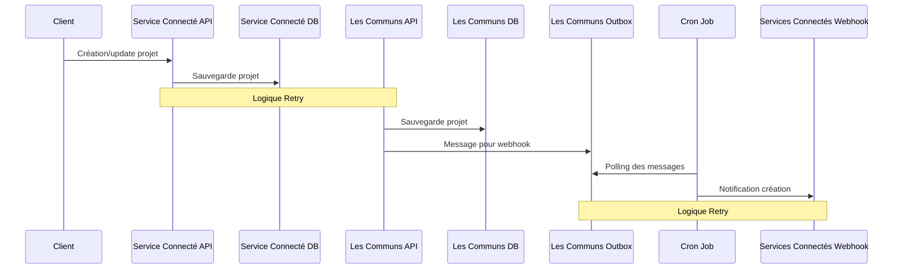
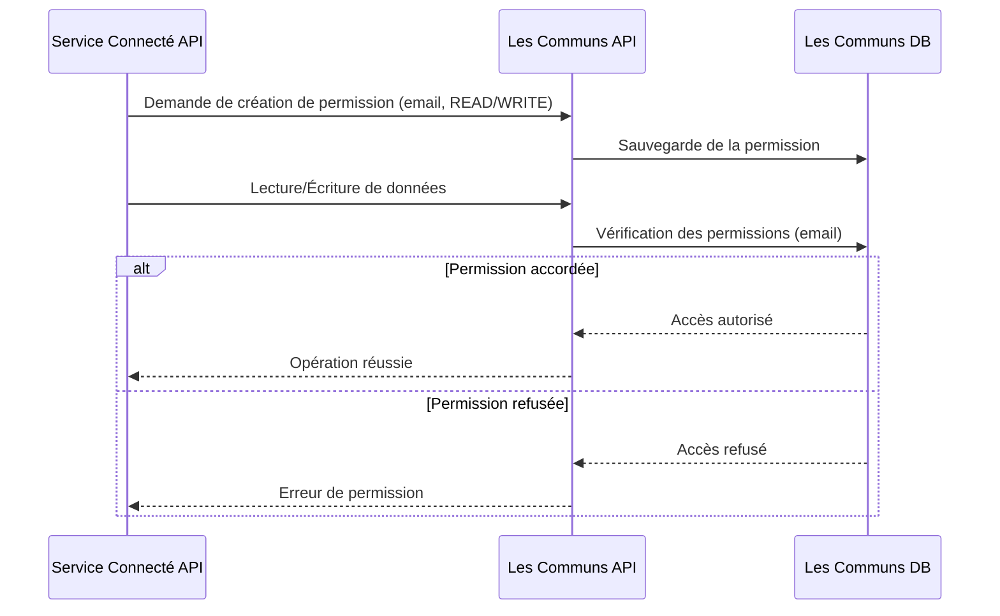

# Suivi de projets inter-services via les communs

## Table of Contents

- [Contexte](#Contexte)
- [Workflow General](#Informations-personnelles)
- [Permissions](#Informations-personnelles)
- [Informations personnelles](#Informations-personnelles)
- [Status](#status)

Les décisions/archi proposés ici sont le fruit d'un travail collaboratif de comparaison et d'analyse que vous pouvez trouver sur ce [document notion](https://www.notion.so/incubateurdesterritoires/Suivi-de-projets-inter-services-via-les-communs-149744bf03dd80dfb9c0e0cd6e31eecd?pvs=4) 

## Contexte

- Plusieurs services connectés existent pour suivre l’avancée de projets locaux. Un nouveau service, Les Communs (LC), est créé pour suivre un projet à travers ces services connectés (SC).
- Exemple : un projet créé dans TeT peut être importé dans MEC avec les mêmes informations.
- Les changements de statut doivent être synchronisés entre les services.
- Les niveaux d’accès doivent être propagés entre les services.
- Partager un maximum d’information entre les projets.

## Workflow General

Plusieurs points importants :
- La BD des Communs est une **copie** pour les données génériques des projets. 
- Les services connectés doivent tenir les communs à jour des opérations qui ont lieu sur les données génériques des projets. (changement de status, mise à jour de la description etc). Pour se faire les services connectés doivent mettre en place une logique résiliente qui permet de s'assurer que les communs sont toujours à jour. 
- Les Communs, quand ils reçoivent des changements, les propagent aux webhooks dédiés des services connectés. 
- Chaque service connecté aura une clef API pour se connecter aux communs

Diagramme de séquence pour la solution envisagée :
 

## Permissions

Assurer l’accès aux projets entre MEC et TeT, malgré des règles d’accès différentes. Par un exemple un service connecté peut avoir des règles complexes pour afficher le projet pour un utilisateur (appartenance à une commune ou autre).

Cette logique d'accès est propre à chaque service connecté et Les communs ne peuvent en avoir connaissance. Mais Les Communs devraient quand même avoir une logique de permission pour s'assurer que tel utilisateur est bien autorisé à accéder à ces ressources.

La solution est donc d'avoir un système de permissions basique dans les Communs dont les Services Connectés auront le controle. 

Pour les besoins des permissions Les Communs auront donc besoin des emails des utilisateurs que nous utiliserons pour leur associer des permissions. 

Pour l'instant le niveau de permission est "READ"/"WRITE" - et pourra évoluer par la suite. 

## Informations personnelles

On veut partager un maximum d’informations tout en respectant la RGPD.
La notion de porteur référent de projets étant très importante pour l'écosystème, les informations seront stockées / partagée via les communs.
Pour les autres emails comme ceux liés aux permissions, ceux-ci seront hashé dans la base de donnée pour ne pas les stocker en clair.

Les services doivent tenir LC à jour pour effacer les infos des utilisateurs inactifs. 

## Status

Les Communs utilisent un système de statuts génériques pour permettre la synchronisation entre les différents services, tout en respectant leurs status plus granulaires :

Les status génériques sont encore en cours de définition avec les différents services

**Statuts génériques des Communs (WIP) :**
- IDEE
- FAISABILITE
- EN_COURS
- IMPACTE (pour les états de retard/pause/blocage)
- ABANDONNE
- TERMINE

Chaque service connecté maintient son propre système de statuts détaillé, qui est mappé vers ces statuts génériques. Les changements de statut suivent le workflow suivant :

1. Un service connecté met à jour un statut
2. Le statut est traduit en statut générique dans Les Communs
3. Si le statut générique change, Les Communs notifient les autres services via webhook
4. Chaque service traduit le statut générique vers son système de statuts spécifique

Cette approche permet de :
- Préserver l'autonomie des services dans leur gestion détaillée des statuts
- Assurer une synchronisation cohérente entre les services
- Faciliter l'intégration de nouveaux services avec des systèmes de statuts différents

Recap du mapping potentiel : 

| MEC / Recoco | Generic Status (MEC) | TeT | Generic Status (TeT) | Status Aide territoire | Generic Status (AT) |
|--------------|---------------------|-----|---------------------|----------------------|-------------------|
| Non démarré, intention | IDEE | A venir | IDEE | Réflexion / conception | IDEE |
| Etudes pré-opérationnelles non initiées | IDEE | A discuter | FAISABILITE | Mise en oeuvre / réalisation | EN_COURS |
| Etudes pré-opérationnelles en cours | FAISABILITE | En cours | EN_COURS | Usage / valorisation | TERMINE |
| Etudes pré-opérationnelles terminées | FAISABILITE | En retard | IMPACTE | | |
| Etudes opérationnelles non initiées | FAISABILITE | En pause | IMPACTE | | |
| Etudes opérationnelles en cours | EN_COURS | Bloqué | IMPACTE | | |
| Etudes opérationnelles terminées | EN_COURS | Réalisé | TERMINE | | |
| Opération démarrée | EN_COURS | Abandonné | ABANDONNE | | |
| Opération terminée, livrée | TERMINE | | | | |
| Opération abandonnée, annulée | ABANDONNE | | | | |
| Opération en pause, reportée | IMPACTE | | | | |

### exemple de flow utilisateur

- Un projet crée sur MEC démarre initialement avec un status Non démarré, intention (aucune étude initiée)
- Sur Les communs le projet est enregistré avec le status IDEE , ce projet + status est propagé à Tet et Recoco via webhook.
- Quand un utilisateur visionne ce projet sur Tet ou sur Recoco, il voit le premier status équivalent à la catégorie générique sur les Communs : A venir
- L’utilisateur le change dans MEC pour le faire passer au status Etudes pré-opérationnelles non initiées
- Sur les communs le projet reste en IDEE  pas de changement de status est propagé à Tet et Recoco via webhook.
- Sur Tet l’utilisateur change le status à En cours, Tet contacte les communs
- Sur les communs le status est changé en EN_COURS  Ce changement de status est propagé à MEC et Recoco via webhook.
- MEC change le status à Etudes opérationnelles en cours et Recoco aussi