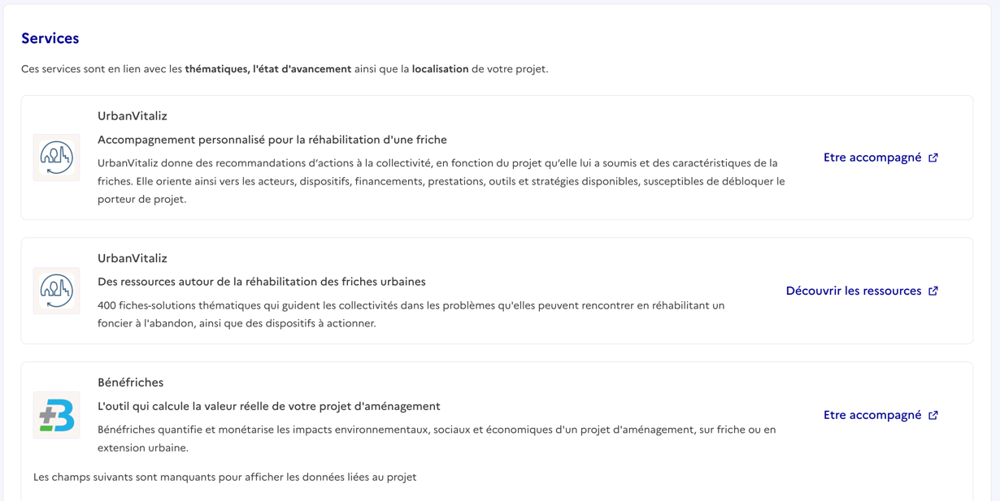
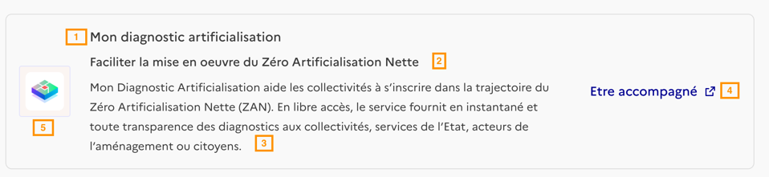

## Contexte

Un des outils développé et maintenu par les Communs est le **widget de présentation des services liés**

Ce widget permet de prendre les informations d'un projet (via notre base de données) et de présenter les services pertinents en fonction du contexte de ce projet.

### Plateformes intégrants le widget

Pour le moment, nous testons le widget sur les plateformes Territoires en transition (sur la vue fiche action) et dans mon espace collectivité sur la vue projet.

### Sélection et présentation des services

Les services présentés sont pour l'instant sélectionnés par l'équipe des communs (pour tester la proposition de valeur). À terme, nous souhaitons que ce soit l'écosystème qui sélectionne et valide les services présentés.

Vous pouvez retrouver la liste complète des services présentés sur [la démo du widget](https://les-communs-transition-ecologique-api-staging.osc-fr1.scalingo.io/sandbox/)

Sur cette démo, tous les services sont présentés peu importe le contexte. Les services sont soient :

- publiés : ces services ont été validés et sont présentés aux utilisateurs
- non publié : ces services ne sont pas encore validés et sont simplement référencés dans la démo pour visualisation

### Logique d'affichage des services

Les services sont choisis sur la base de 3 critères :

- l'avancement du projet (idée / étude / opération)
- les compétences (référentiel M57) ou les leviers de la TE associés.
- A VENIR : l'implantation territoriale du projet. (sur une collectivité ou territoire spécifique).

Vous pouvez retrouver les critères associés à chaque service sur ce document : https://docs.google.com/spreadsheets/d/1Vmcq_s_799Bj8QP56Q3BzajHtZsk78Z8Lhg4gtmwGrg/edit?usp=sharing

Pour la suite, nous mettrons à disposition dans la démo qui listent tous les

### Intégration des services

Il y a plusieurs niveaux d’intégration possible dans le widget, par example :

- **une intégration simple** : un simple lient vers une page spécifique du service recensé (par exemple pour les communautés d’Expertise Territoire)
- **une intégration iframe** : un service recensé met à disposition un iframe qui s'affiche en fonction des paramètres de projet qu’on lui passe dans l’url (exemple Facilitact, Bénéfriche)
- **une intégration custom** : des scénarios d’intégration plus poussés comme par exemple amener directement l’utilisateur dans son projet contextualisé sur la plateforme (par exemple avec Recoco, un utilisateur pourrait être créé à la volée ainsi que son projet)

### Guide pour la présentation du contenu

Principalement nous avons besoin pour une intégration de base de :

- du nom du service (1)
- d'un sous titre (2) (reco : entre 50 et 100 caractères)
- d'une description (3) (tronqué à 400 caractères sur desktop et 200 sur mobile)
- d'une url de redirection + un label pour le CTA (optionnel si CTA par défaut) (4)
- un logo (5)

Voici la liste complète des services que nous avons integré à date : https://les-communs-transition-ecologique-api-staging.osc-fr1.scalingo.io/sandbox/
